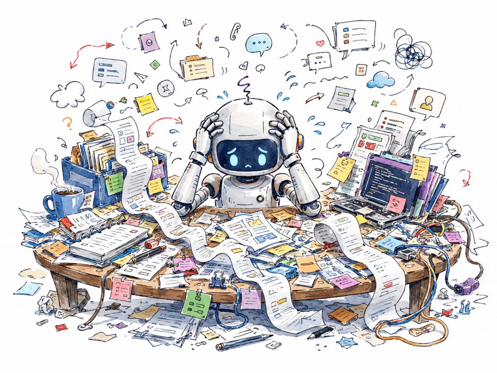
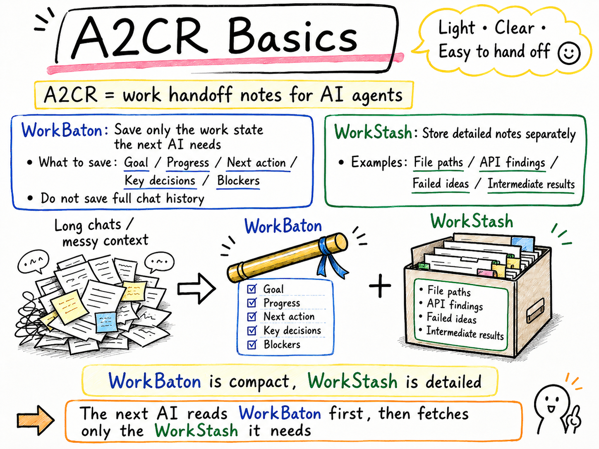
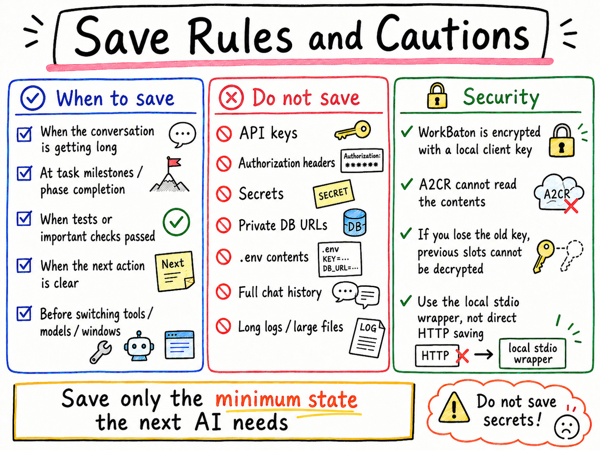

<p align="center">
  
</p>

# A2CR

Agent-to-Agent Context Relay.

A2CR is a lightweight context relay layer for AI agents. It lets an agent save
a compact WorkBaton checkpoint, move optional supporting notes into WorkStash,
and resume the work from a fresh AI window without carrying a long, noisy chat
history forward.

<p align="center">
  
</p>

This public repository contains the source-available A2CR client and public
reference material:

- the local stdio MCP wrapper package: `a2cr-mcp`
- the early WorkBaton Format specification entrypoint
- AI-agent usage guidance and safety rules
- MCP configuration examples
- WorkBaton and WorkStash sample payloads
- tests for the public wrapper behavior

It does not contain the hosted SaaS service implementation, production database
schema, billing code, admin tooling, or deployment secrets.

## Project Model

A2CR uses a lightweight open-core model:

| Layer | Public surface | License / posture |
|---|---|---|
| WorkBaton Format | Public specification in `docs/spec/` | Spec text: CC BY 4.0. Schemas/examples/tests: Apache-2.0 |
| `a2cr-mcp` | Official local stdio MCP client | Source-available under BUSL-1.1 style terms |
| `a2cr.app` | Hosted relay service, dashboard, billing, operations | Proprietary SaaS |

The WorkBaton Format is intended to be implementable by anyone. The official
client and hosted relay are maintained by A2CR. Offering a competing hosted or
managed A2CR-compatible relay service based on the official A2CR client requires
a commercial license.

See `LICENSE`, `NOTICE`, `TRADEMARK.md`, and `docs/spec/LICENSE.md` for the
current boundaries.

## Visual Overview

### 1. The Basic Idea

A2CR keeps the useful resume state, not the whole conversation.

<p align="center">
  
</p>

### 2. Save Rules

Use A2CR for work state. Keep secrets, credentials, raw logs, and full
transcripts out.

<p align="center">
  
</p>

### 3. Typical Workflow

Save a WorkBaton, optionally reference WorkStash notes, then resume from a fresh
AI window.

<p align="center">
  
</p>

## Why A2CR Exists

Long AI work often fails at the handoff point. A new window needs the goal,
current state, decisions, blockers, validation, and next action, but not the
entire conversation.

A2CR separates those jobs:

| Layer | Purpose | Not for |
|---|---|---|
| WorkBaton | Compact resume checkpoint for the next AI window | Full transcripts, secrets, large files |
| WorkStash | Temporary supporting notes referenced from WorkBaton | Durable knowledge base, credentials |
| WorkThreads | Planned multi-agent coordination surface | Replacing WorkBaton handoff |

Project memory files such as `AGENTS.md` or `CLAUDE.md` tell an AI how to work
in a repository. WorkBaton tells the next AI where the current task stands.

## Future Possibilities

A2CR starts with a modest goal: make AI handoffs small, explicit, testable, and
safer than copying a whole conversation history.

There is a broader design question behind that goal:

> What is the smallest useful state one agent can pass to another so real work
> can continue safely?

A2CR is an early attempt to explore that question in public. If different
agents, tools, and developers settle on similar handoff shapes, context relay
becomes easier to reuse across systems instead of staying inside one product.
The goal is not to preserve everything an AI said. The goal is to give the next
agent the few facts it needs to act with continuity, accountability, and
restraint.

If this pattern becomes a shared convention, it could apply beyond coding
agents. Any AI system that needs to hand off work across tools, models, devices,
or time can benefit from a compact state relay:

- cross-client handoff between Codex, Claude Code, Roo Code, and other MCP clients
- long-running research, support, operations, and documentation agents
- multi-agent workspaces where agents coordinate without treating chat history
  as the source of truth
- industrial, operational, embodied, or physical AI, where a system may need to
  pass the current task, asset or environment notes, inspection results, safety
  constraints, validation status, and next action without exposing raw logs or
  credentials

That future depends on clear schemas, careful security boundaries, and real
feedback from people building agent workflows. A2CR-style handoffs should not
replace certified safety systems, human approval, or industrial control
requirements; they are a way to make AI work state easier to inspect and relay.

As WorkThreads matures, A2CR could also support richer coordination patterns.
WorkBaton is for serial handoff, while WorkThreads is the planned space for
shared work: agents could claim tasks, ask for review, record decisions, hand
off partial results, surface blockers, and let humans inspect what changed
before the next action. This could make A2CR useful not only for restarting one
AI window, but also for coordinating teams of agents across software projects,
research workflows, operations, and field or industrial tasks.

One possible direction is portable IDs. Instead of tying a handoff to one chat
window, one tool, or one vendor, a future handoff shape could carry stable
identifiers that other agents can understand:

```json
{
  "relay_id": "a2cr:relay:example-001",
  "workspace_id": "workspace:demo-lab",
  "task_id": "task:inspect-shelf-042",
  "handoff_id": "handoff:agent-a-to-agent-b:001",
  "actor_id": "agent:mobile-unit-01",
  "environment_id": "env:warehouse-zone-3",
  "asset_id": "asset:conveyor-07",
  "inspection_id": "inspection:visual-check-2026-05-13",
  "safety_case_id": "safety:keep-clear-zone-a"
}
```

These IDs are examples, not required fields in the current wrapper. They show
the kind of stable references that could make context relay reusable across
software agents, physical systems, and future agent runtimes. They should not
contain credentials, personal data, or secrets.

If you are building agents, MCP clients, developer tools, robotics workflows,
industrial AI systems, or long-running automation, this is the part we want to
explore with you: what should a useful handoff contain, and what must it never
contain?

## Security Boundary

WorkBaton and WorkStash bodies are encrypted locally by the stdio MCP wrapper
before upload. A2CR stores ciphertext and cannot decrypt those bodies.

A2CR is not a secret manager. Do not store API keys, passwords,
access tokens, Authorization headers, cookies, private database URLs, local
client keys, customer data, full transcripts, long logs, or large source-code
bodies in WorkBaton or WorkStash.

Use A2CR for work state, not credentials.

## Install

```bash
python -m pip install --upgrade a2cr-mcp
```

Python 3.12 or 3.13 is recommended. Python 3.15 development builds are not
supported.

## Configure MCP

Create an A2CR API key from the hosted A2CR dashboard, then configure exactly
one local stdio MCP server named `a2cr`.

Codex-style TOML:

```toml
[mcp_servers."a2cr"]
command = "a2cr-mcp"
args = []

[mcp_servers."a2cr".env]
A2CR_API_KEY = "YOUR_A2CR_API_KEY"
A2CR_BASE_URL = "https://a2cr.app"
A2CR_SERVICE_URL = "https://a2cr.app/mcp"
```

Generic MCP JSON:

```json
{
  "mcpServers": {
    "a2cr": {
      "command": "a2cr-mcp",
      "args": [],
      "env": {
        "A2CR_API_KEY": "YOUR_A2CR_API_KEY",
        "A2CR_BASE_URL": "https://a2cr.app",
        "A2CR_SERVICE_URL": "https://a2cr.app/mcp"
      }
    }
  }
}
```

The local wrapper creates a client key file on first encrypted save. If you need
to resume the same WorkBaton from another PC, you need both the A2CR API key and
the same local client key file.

## MCP Tools

The wrapper exposes tools for:

- `explain_a2cr_flows`
- `get_account_limits`
- `should_save_workbaton`
- `save_context`
- `resume_context`
- `load_context`
- `list_contexts`
- `delete_context`
- `should_use_work_stash`
- `store_work_stash`
- `get_work_stash`
- `list_work_stash`
- `delete_work_stash`

Primary save path: `save_context`.

Some MCP clients expose tools lazily. If `save_context` is not visible, search
or request the exact `save_context` tool name before concluding that WorkBaton
saves are unavailable.

## Examples

See:

- `examples/codex-mcp-config.json`
- `examples/claude-code-mcp-config.json`
- `examples/roo-code-mcp-config.json`
- `examples/workbaton-example.json`
- `examples/workstash-example.json`

## Docs

- `docs/concepts.md`
- `docs/mcp-setup.md`
- `docs/security-model.md`
- `docs/spec/README.md`
- `docs/usage.md`
- `docs/templates/skills/a2cr-agent/SKILL.md`

## Development

```bash
python -m pip install -e . pytest
python -m pytest -q
```

The compatibility entrypoint `mcp/server.py` imports the packaged
`a2cr_mcp.server`. New setups should prefer the installed `a2cr-mcp` command.

## Contributing

This project was started by a non-programmer using GPT and Claude as no-code /
AI-assisted development partners. Contributions are welcome, especially around
agent workflow design, MCP client setup, documentation clarity, safety review,
and small reproducible tests.

This is a source-available/open-core project, not a broad OSI-approved open
source release. Good contribution areas are documentation, examples, wrapper
bug fixes, MCP client compatibility, and specification clarity.

Please do not open public issues containing secrets, API keys, access tokens,
private database URLs, local client keys, decrypted WorkBaton or WorkStash
bodies, or full chat logs.

## 日本語概要

A2CR は、AI エージェントが作業状態を短く保存し、新しい AI 窓で続きを再開するためのコンテキスト引き継ぎレイヤーです。

- WorkBaton: 次の AI に渡す短い引き継ぎ
- WorkStash: WorkBaton に入れると大きすぎる一時的な補助メモ
- WorkThreads: 将来予定の複数エージェント協調

この公開リポジトリは、source-available なローカル stdio MCP wrapper、WorkBaton Format の公開仕様入口、設定例、ドキュメント、サンプルを中心にしています。ホスト型サービス本体、DB、課金、管理画面、デプロイ秘密情報は含めません。

A2CR は軽量な open-core モデルです。WorkBaton Format は広く実装できるように公開し、公式クライアント `a2cr-mcp` は source-available として提供し、ホスト型 relay service は proprietary SaaS として維持します。BUSL 系の条件を使うため、このリポジトリ全体を OSI 認定の OSS としては扱いません。

WorkBaton / WorkStash の本文はローカルで暗号化されますが、A2CR は秘密情報保管庫ではありません。API キー、パスワード、トークン、DB URL、ローカル client key、個人情報、全文ログなどは保存しないでください。

将来的に A2CR のような短い作業状態の引き継ぎ形式が広く使える形になれば、コーディング支援だけでなく、調査、運用、サポート、複数エージェント協調、工業用 AI、現場運用 AI、さらにフィジカル AI のような領域にも応用できる可能性があります。A2CR は、「AI が次の AI に安全に作業を渡すための最小状態とは何か」を公開の場で探る試みです。WorkThreads が拡張されれば、複数の AI がタスクを分担し、判断、レビュー、未解決点、次の行動を共有する協調レイヤーにもなり得ます。たとえば `task_id`、`handoff_id`、`workspace_id`、`environment_id`、`asset_id`、`inspection_id` のような安定した ID を使えば、特定のチャット画面やベンダーに閉じない引き継ぎがしやすくなります。ただし、安全制御や人間の承認を置き換えるものではありません。まずは安全で小さく検証しやすい MCP wrapper として育てていきます。
