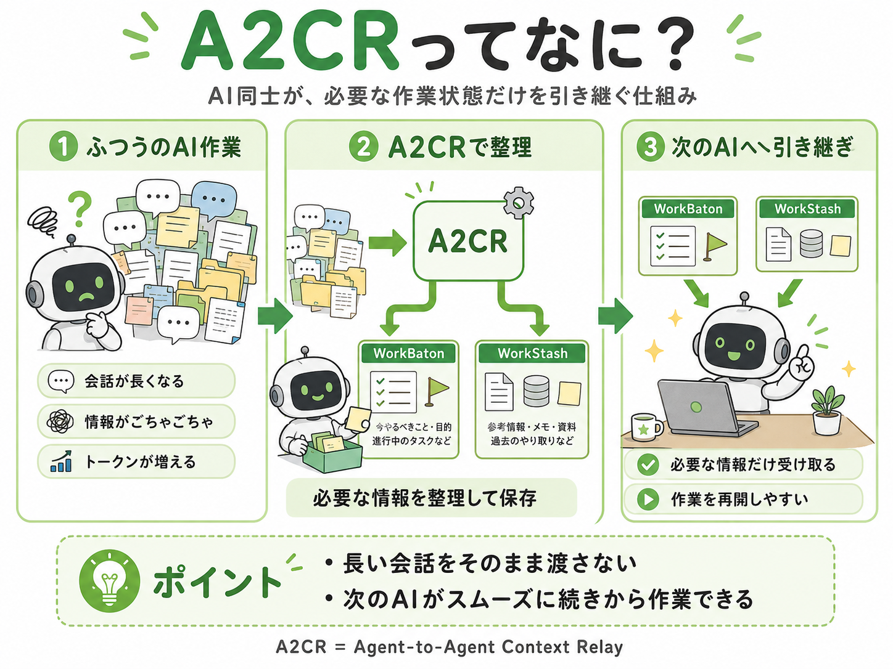
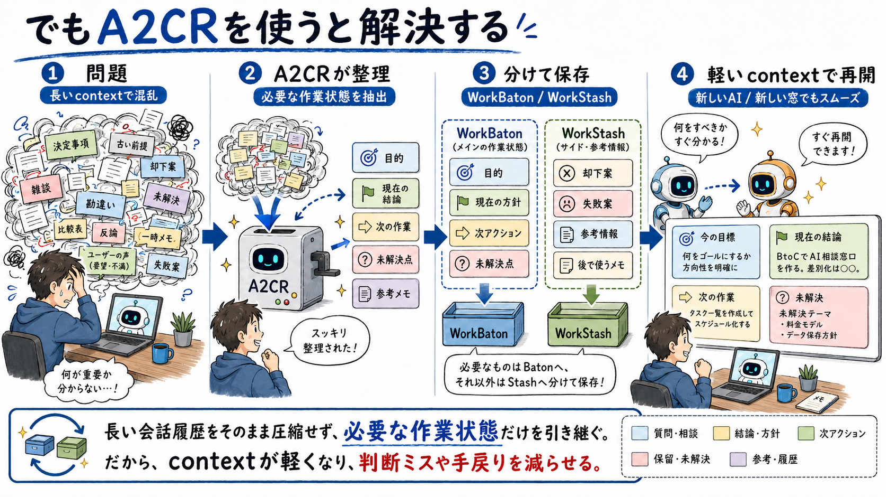

# 前のAIの続きを、新しいAIに渡せるようにしたい

AIに作業を手伝ってもらっていると、途中でこういうことが起きます。

「さっきまで何をやっていたんだっけ？」

「この続き、別のAIに渡したいけど、何を説明すればいいんだろう？」

「前の会話を全部貼ると長すぎるし、余計な情報も混ざってしまう」



Claude Codeで途中まで進めた作業を、Codexで続けたい。

Codexで調べた内容を、新しい窓で続けたい。

別のAIに作業を渡したい。

こういう時に必要なのは、前の会話を丸ごと渡すことではありません。

次のAIが作業を再開するための、短い引き継ぎメモです。

## 困るのは「引き継ぎが重い」こと

人間同士の仕事でも、引き継ぎで会議の録音を丸ごと渡されたら困ります。

欲しいのは、たぶんこういう情報です。

- 何をしていたか
- どこまで終わったか
- 次に何をすればいいか
- 何を確認済みか
- 何に詰まっているか

AIも同じです。

長い会話を全部渡すより、必要なことだけを小さくまとめた方が、次のAIは動き出しやすくなります。


## A2CRは「AI向けの引き継ぎメモ」を保存する仕組みです

A2CRは、AIとの作業状態を保存して、新しい窓で呼び出せるようにするための仕組みです。

最初は、こう考えれば十分です。

> 前のAIがどこまで進めたかを、小さな引き継ぎメモとして残すもの

A2CRでは、この小さな引き継ぎメモに **WorkBaton** という名前を付けています。

名前は覚えなくても大丈夫です。大事なのは、「次のAIに渡す短いメモ」だということです。

たとえば、こんな内容だけを残します。

```text
やっていたこと:
READMEの説明を、初めて読む人にもわかるように直していた。

終わったこと:
「前の会話を全部渡すのではなく、必要な作業状態だけを渡す」
という説明に変えた。

次にやること:
Xの返信で使える、短い紹介文を作る。

確認済み:
READMEの変更は公開リポジトリに反映済み。
```

これなら、新しいAIはすぐに続きを始められます。

## 細かいメモは、別の箱に分ける

作業をしていると、細かいメモも必要になります。

たとえば、参考にしたファイル、調べた結果、失敗した案、あとで見返すかもしれない補足などです。

こういうものを全部、最初の引き継ぎメモに入れると、また読みにくくなります。

そこでA2CRでは、次のAIが最初に読む短いメモと、必要な時だけ見る補足メモを分けます。

短いメモは「まず読むもの」。

補足メモは「必要なら見るもの」。

この分け方が大事です。

## 保存してはいけないもの

A2CRは、秘密情報を入れる場所ではありません。

保存してはいけないものがあります。

- APIキー
- パスワード
- `.env` の中身
- 認証ヘッダー
- Cookie
- データベースの秘密URL
- 会話全文
- 長いログ
- 大きなソースコード

保存するのは、次のAIが作業を再開するための最小限の状態だけです。

ここはかなり重要です。

## どういう時に便利か

A2CRは、短い質問には必要ありません。

次のような時に役に立ちます。

- AIとの作業が長くなってきた
- 別のAIツールに続きを渡したい
- 新しい窓で作業を再開したい
- 前の会話を全部貼るのが重くなってきた
- 「次に何をするんだっけ？」が起きやすい

たとえば、Claude Codeで調査して、Codexで修正する。

Codexで作業して、別の新しい窓で検証を続ける。

こういう時に、A2CRは「前のAIの続きをどう渡すか」を助けます。



## まずは1回だけ試してほしいこと

最初から完璧に使う必要はありません。

まずは、1つの作業でこれだけ試してみてください。

1. いま何をしているかを保存する
2. 新しい窓を開く
3. さっき保存した内容を呼び出す
4. 新しいAIが続きを理解できるかを見る

うまくいけば、「前の会話を全部貼らなくても、続きから始められる」感覚がわかると思います。

もし途中で詰まったら、その場所を教えてください。

今は公開したばかりなので、特に知りたいのは「どこが分かりにくいか」です。

## リンク

- A2CR GitHub: https://github.com/a2cr/a2cr
- 使い方の入り口: https://github.com/a2cr/a2cr/blob/main/README-ja.md
- ローカル版の設定: https://github.com/a2cr/a2cr/blob/main/docs/mcp-setup.md
- 詳しい使い方: https://github.com/a2cr/a2cr/blob/main/docs/usage.md

A2CRは、AIに全部を覚えさせるためのものではありません。

次のAIが作業を再開できるように、必要な状態だけを渡すためのものです。
